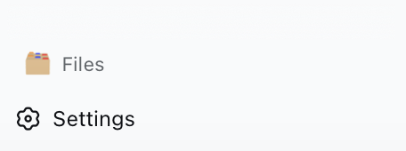

# dsh-workspace-files

DSH Web UI plugin: "Files" button at the bottom of the sidebar → floating file panel to browse the current session's workspace directory; files and directories can be opened in Finder or VS Code.



## Features

- 📂 **File Tree Browsing** — "Files" button at the bottom of the sidebar, click to open a floating panel
- 🔍 **Lazy-loaded Directories** — Follows the current session workspace, expands directories on demand
- 🖥️ **Quick Open** — Directories/files can be opened in Finder (macOS) or VS Code
- 🌐 **Multi-language** — Supports Chinese/English, follows DSH interface language

## Installation

### Install from GitHub

```bash
# 1. Install the plugin
cd ~/.dsh/profiles/web
pnpm add github:yourname/dsh-workspace-files

# 2. One-click install (build + register bundle)
node node_modules/dsh-workspace-files/scripts/setup.mjs \
  --dsh-checkout ~/deepseek-harness \
  --profile web

# 3. Restart DSH Web UI
```

### Install from Local

```bash
# 1. Install the plugin
cd ~/.dsh/profiles/web
pnpm add /path/to/dsh-workspace-files

# 2. One-click install
node node_modules/dsh-workspace-files/scripts/setup.mjs \
  --dsh-checkout ~/deepseek-harness \
  --profile web

# 3. Restart DSH Web UI
```

> **Tip**: You can also use the environment variable `DSH_CHECKOUT=~/deepseek-harness node scripts/setup.mjs`

## Prerequisites

- DSH **web** profile (UI plugin, headless mode is not supported)
- **macOS** — "Open in Finder" requires macOS; VS Code open works on Windows/Linux, file tree browsing works on all platforms

## Verification

After installation and restart:

1. "Files" (English) / "文件" (Chinese) button appears at the bottom of the sidebar
2. Click to open the file tree panel, following the current session workspace
3. Directories/files can be opened normally

## Development

### Build

```bash
DSH_CHECKOUT=/path/to/deepseek-harness pnpm build
```

Build artifacts are output to the `lib/` directory:
- `lib/index.js` — host half (HTTP endpoints)
- `lib/client.js` — browser half (UI panel)

### Debug Commands

```bash
# Check if browser bundle is loaded
curl localhost:3080/plugins/dsh-workspace-files/client.js

# Check if host endpoint returns file list
curl "localhost:3080/ws-files/list?path=/Users"
```

### Directory Structure

```
dsh-workspace-files/
├── src/
│   ├── index.ts              # host half: /ws-files/list, /ws-files/open endpoints
│   └── client/
│       ├── index.ts          # client half: sidebar registration + locale
│       ├── FileBrowser.tsx   # file tree UI component
│       ├── locales.ts        # Chinese/English dictionary
│       └── wsf.css.ts        # panel styles
├── tsdown.config.ts          # build configuration
├── package.json
└── cordis.patch.yml          # bundle loading patch
```

## License

MIT
